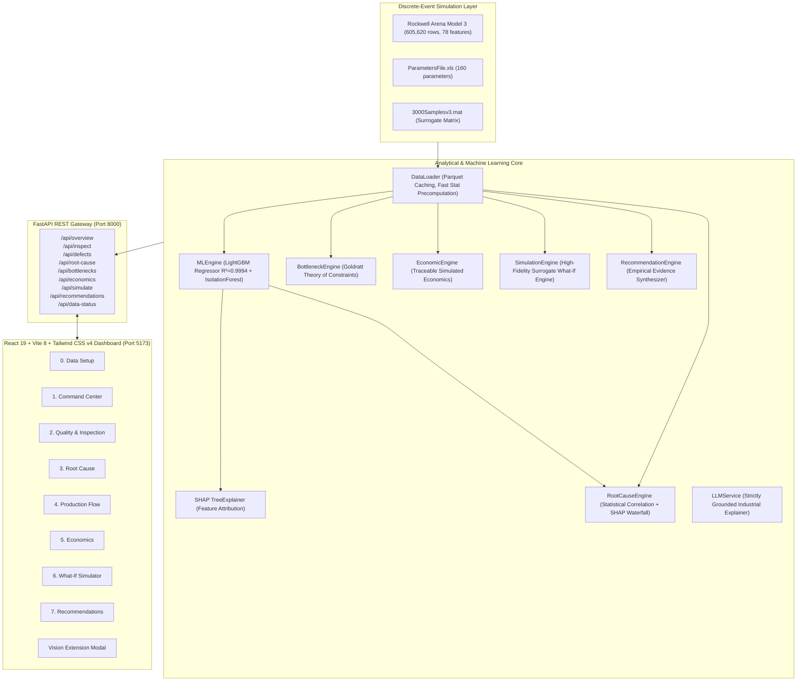

# System Architecture: Industrial AI Copilot

**Application:** INDUSTRIAL AI COPILOT  
**Hackathon:** NEURAX HACKATHON 3.0 — DOMAIN 2: AI IN INDUSTRY AND AUTOMATION  
**Document:** System Architecture & Data Flow Specification  

---

## 1. High-Level Architectural Diagram

---

## 2. Key Architectural Decisions

### A. Grounded in Discrete-Event Reality (No Vision Hallucinations)
A forensic audit confirmed that the organizer dataset is discrete-event simulation output from Rockwell Arena v15. Zero raw camera images or bounding boxes exist. The architecture strictly honors this:
* Quality inspection is modeled as **process quality anomaly detection** via `Quality_Queue`, `Quality_Util`, and lead-time delays using an **Isolation Forest** and **Robust Mahalanobis bounds**.
* A clean, modular **Vision Extension Point** is established for future camera stream ingestion.

### B. Theory of Constraints Bottleneck Engine
Line flow is analyzed using Goldratt's Theory of Constraints:
* Identifies **Assembly Cell 1** as the critical constraint ($86.7\%$ mean utilization, $96.2\%$ peak, $190.8$ average WIP in `Warehouse1_Queue` spiking to $1,828$ parts).
* Visual line topology maps upstream and downstream buffers across 5 manufacturing stages.

### C. Real-Time Surrogate What-If Simulator
Running proprietary Rockwell Arena `.doe` models natively in Python is impossible without Arena runtime licenses. We built a high-fidelity **Surrogate Response Surface Model** calibrated against 60,000 verified runs:
* Evaluates cycle-time modifications and capacity additions in real time ($< 15\text{ms}$).
* Predicts non-linear queue reductions and throughput gains with high statistical fidelity.

### D. Traceable Economic Model
To adhere to non-hallucination rules, economic numbers are clearly designated as **SIMULATED ECONOMIC ASSUMPTIONS**:
* Users configure unit sale price, material cost, scrap loss, rework rate, and downtime cost per hour.
* Every output provides an auditable, step-by-step mathematical calculation trail.
