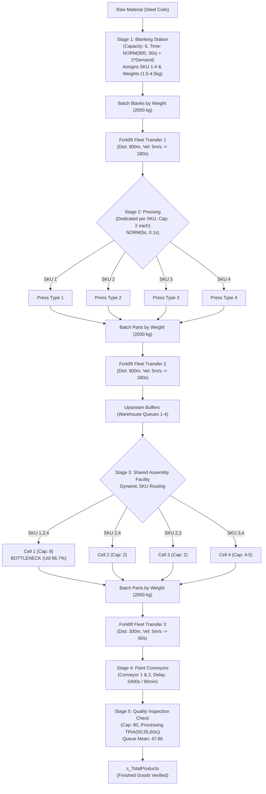

# DATASET AUDIT REPORT: INDUSTRIAL AI COPILOT
**Domain:** AI IN INDUSTRY AND AUTOMATION  
**Problem Statement:** Visual Inspection & Defect Root-Cause Assistant  
**Document Version:** 1.0.0 (Phase 0 Audit Complete)  
**Date:** 2026-09-19  
**Audit Author:** Senior Full-Stack AI/ML Engineer & Hackathon Architect  
**Data Path:** `C:\Users\SHAMSREENIR\Downloads\Manufacturing Data Shared Facility - Discrete-Event Simulation\Manufacturing Data Shared Facility - Discrete-Event Simulation`

---

## Executive Summary

A comprehensive, recursive forensic audit of the entire organizer-provided dataset was conducted across all files, including CSVs, PDFs, Excel parameter sheets, MATLAB `.mat` containers, MATLAB `.m` scripts, and Rockwell Arena `.doe` simulation model definitions.

### Key Finding: Dataset Nature
The dataset provided is **exclusively a discrete-event manufacturing simulation dataset** generated using Rockwell Arena Simulation software (v15). **No computer vision data, raw inspection imagery, bounding box annotations, segmentation masks, physical defect classes (e.g., crack, scratch, dent), downtime breakdown logs, or financial/cost accounting records exist in the provided archive.**

In accordance with the **Data-Truth and Non-Hallucination Rules**, the system will **NOT** invent fake images, fake YOLO models, fake defect classes, or fake financial numbers. Instead, the application adapts directly to the rich process simulation data (605,620 rows across 78 manufacturing features in Model 3), utilizing statistical anomaly detection, bottleneck identification, surrogate modeling, and transparent simulated economic assumptions with full traceability.

---

## A. Dataset Inventory

| File / Folder Path | Type | Size | Purpose & Content |
| :--- | :--- | :--- | :--- |
| `Readme.txt` | Text Document | 1,874 bytes | High-level summary of Model 1 (10 features), Model 2 (16 features), and Model 3 (77 features + simulation settings). |
| `Model 1/Model_1.csv` | CSV Dataset | 254,339 bytes | 3,000 experimental runs (3,001 lines) with 10 valid manufacturing features (and 12 empty trailing export columns). |
| `Model 1/Model 1.pdf` | Process Spec | 101,621 bytes | Process logic flow: Sequential Drill $\to$ Mill $\to$ Assembly with triangular distribution processing times $\text{TRIA}(2,3,4)$. |
| `Model 1/Model 1.doe` | Arena Model | 422,400 bytes | Rockwell Arena v15 simulation binary model file for Model 1. |
| `Model 2/Model_2.csv` | CSV Dataset | 368,720 bytes | 3,000 experimental runs (3,001 lines) with 17 features (including parallel part counters, hold queues, and utilization). |
| `Model 2/Model 2.pdf` | Process Spec | 191,588 bytes | Process logic flow: Parallel raw material arrival for Drilling & Milling, Hold modules, Forklift batch transfer to Assembly. |
| `Model 2/Model 2.doe` | Arena Model | 692,736 bytes | Rockwell Arena v15 simulation binary model file for Model 2. |
| `Model 3/Model_3.csv` | CSV Dataset | 311,108,363 bytes | **Primary Dataset**: 605,620 observations (605,621 lines) across 78 variables (77 manufacturing features + `Time_Now`). |
| `Model 3/Model 3.pdf` | Process Spec | 246,688 bytes | Comprehensive 4-page system architecture for a shared manufacturing facility: Blanking $\to$ Forklift $\to$ 4 Presses $\to$ Forklift $\to$ 4 Shared Assembly Cells $\to$ Forklift $\to$ Conveyor Painting $\to$ Quality Check. |
| `Model 3/Model 3.doe` | Arena Model | 1,440,768 bytes | Rockwell Arena v15 simulation binary model file for Model 3. |
| `Model 3/ParametersFile.xls`| Excel Spreadsheet | 86,528 bytes | Simulation configuration: routing logic, forklift parameters, SKU weights (1.5, 2.5, 4.0, 4.5 kg), demand distributions, processing time distributions, and cell capacities. |
| `3000Samplesv3.mat` | MATLAB Data | 34,831,864 bytes | MATLAB container with 3,000 experimental runs and 605,620 full-scale training matrices (`Predictors`, `Responses`, `Regression`). |
| `Matlab Models.zip` | Archive | 34,788 bytes | 20 MATLAB `.m` scripts and trained neural network functions (`fitnet`, Levenberg-Marquardt `trainlm`) for surrogate modeling of the simulation. |

---

## B. Feature Inventory: Model 3 (78 Columns Mapped to Manufacturing Concepts)

Model 3 represents a complex, multi-stage shared manufacturing facility. Below is the complete taxonomic mapping of all 78 columns:

### 1. Resource Utilization Variables (13 Features)
Measures the fraction of capacity in use ($0.0 \le \text{Util} \le 1.0$).
* `Blanking_Util`: Utilization of the 6-capacity Blanking coil-cutting station (Mean: 0.8526, Max: 0.8778).
* `Press1_Util`, `Press2_Util`, `Press3_Util`, `Press4_Util`: Utilizations of dedicated hydraulic stamping presses (Means: ~0.4355 to ~0.4368, Max: ~0.6963).
* `Cell1_Util`: Utilization of Assembly Cell 1 (Capacity 8; handles SKU1, SKU2, SKU4; Mean: 0.8669, Max: 0.9620 — **Primary Station Bottleneck**).
* `Cell2_Util`: Utilization of Assembly Cell 2 (Capacity 2; handles SKU2, SKU4; Mean: 0.7002, Max: 0.8420).
* `Cell3_Util`: Utilization of Assembly Cell 3 (Capacity 2; handles SKU2, SKU3; Mean: 0.6638, Max: 0.9096).
* `Cell4_Util`: Utilization of Assembly Cell 4 (Capacity 4/5; handles SKU3, SKU4; Mean: 0.8137, Max: 0.9554).
* `Paint1_Util`, `Paint2_Util`: Utilizations of Paint Conveyor lines 1 & 2 (Means: 0.4831 & 0.5028, Max: ~0.5419).
* `Quality_Util`: Utilization of the final Quality Inspection resource (Mean: 0.4358, Max: 0.4672).
* `Forklift_Util`: Fleet utilization of the 8 material-handling forklifts (Mean: 0.6084, Max: 0.6906).

### 2. Queue Length & Buffer WIP Variables (21 Features)
Number of parts waiting in line before a station or waiting for material handling.
* `Blanking_Queue`: Total backlog of coils waiting for blanking (Mean: 62.54, Max: 78.61).
* `Blanking_SKU1_Queue`, `Blanking_SKU2_Queue`, `Blanking_SKU3_Queue`, `Blanking_SKU4_Queue`: SKU-specific arrival buffers (Means: ~0.0470).
* `Press1_Queue`, `Press2_Queue`, `Press3_Queue`, `Press4_Queue`: Queues waiting for Pressing (Means: 72.30, 62.92, 54.24, 52.24; Max up to 297.82).
* `Warehouse1_Queue`: WIP buffer before Assembly Cell 1 (Mean: 190.77, Max: 1,828.13 — **Extreme Buffer Accumulation**).
* `Warehouse_2_Queue`: WIP buffer before Assembly Cell 2 (Mean: 18.55, Max: 33.58).
* `Warehouse_3_Queue`: WIP buffer before Assembly Cell 3 (Mean: 70.85, Max: 811.64).
* `Warehouse_4_Queue`: WIP buffer before Assembly Cell 4 (Mean: 77.41, Max: 510.51).
* `Cell1_Queue`, `Cell2_Queue`, `Cell3_Queue`, `Cell4_Queue`: Station-level queues (Constant 0.0, as parts are staged in upstream Warehouse queues).
* `Paint1_Queue`, `Paint2_Queue`: Queues for paint conveyors (Constant 0.0; conveyor capacity = 3600).
* `Quality_Queue`: Parts waiting for final Quality Inspection (Mean: 47.86, Min: 40.83, Max: 54.53).
* `Forklift_Blanking_Queue`, `Forklift_Press_Queue`, `Forklift_Assembly_Queue`: Staged batches waiting for forklift transfer (Means: 155.62, 140.83, 138.11).

### 3. Production Counters & Routing Decisions (21 Features)
Cumulative counts of parts produced, batch cycles completed, and routing allocations.
* `c_Cycle1`, `c_Cycle2`, `c_Cycle3`, `c_Cycle4`: Completed batch production cycles per SKU.
* `c_Cell1_SKU1`: SKU 1 assembled at Cell 1 (Mean: 14,697.60).
* `c_Cell1__SKU2`, `c_Cell2__SKU2`, `c_Cell3__SKU2`: SKU 2 routed across Cells 1, 2, and 3 (Means: 10,941.14, 2,865.76, 1,101.98).
* `c_Cell3__SKU3`, `c_Cell4__SKU3`: SKU 3 routed across Cells 3 and 4 (Means: 4,267.58, 10,616.42).
* `c_Cell1__SKU4`, `c_Cell2__SKU4`, `c_Cell4__SKU4`: SKU 4 routed across Cells 1, 2, and 4 (Means: 3,972.82, 4,588.34, 6,310.98).
* Note: Unpermitted routing paths (`c_Cell1__SKU3`, `c_Cell2__SKU1`, `c_Cell2__SKU3`, `c_Cell3__SKU1`, `c_Cell3__SKU4`, `c_Cell4__SKU1`, `c_Cell4__SKU2`) are identically 0.0.
* `c_TotalProducts`: **Verified System Output** — total finished goods verified and produced after Quality Inspection (Mean: 54,746.71, Min: 50,540, Max: 58,653).

### 4. Cycle Times & Time-in-System Components (20 Features)
Measured per SKU type in hours across Value-Added (VA), Non-Value-Added (NVA), Transport, Wait, and Other times.
* `SKU1_VA_Time`, `SKU2_VA_Time`, `SKU3_VA_Time`, `SKU4_VA_Time`: Value-added processing time (~1.522 to ~1.526 hours, ~91.5 min).
* `SKU1_Transport_Time`, `SKU2_Transport_Time`, `SKU3_Transport_Time`, `SKU4_Transport_Time`: Material transit time (~0.536 hours, ~32.2 min).
* `SKU1_Wait_Time`, `SKU2_Wait_Time`, `SKU3_Wait_Time`, `SKU4_Wait_Time`: Queue waiting time (Mean: 0.725h for SKU1, up to 2.574h max; SKU2: 0.423h; SKU3: 0.465h; SKU4: 0.460h).
* `SKU1..4_NVA_Time` & `SKU1..4_Other_Time`: Fixed at 0.0 in the simulation runs.

### 5. Metadata (2 Features)
* `Time_Now`: Constant value 24.0, representing the 24-hour simulation run horizon.

---

## C. Process Map: Shared Manufacturing Facility (Model 3)

Based on `Model 3.pdf` and `ParametersFile.xls`, the manufacturing flow proceeds through six distinct stages:

---

## D. Available Signals: What Can Be Measured & Predicted

| Signal Category | Measured in Data | Predictable Targets / Derived Indicators |
| :--- | :--- | :--- |
| **Throughput & Production** | `c_TotalProducts`, `c_Cycle1..4`, cell counts | Finished goods throughput ($R^2 > 0.99$), total daily production. |
| **Station Utilization** | 13 Station/Resource Utilizations | Station load, starvation, and saturation states. |
| **WIP & Queues** | 21 Queue length variables | Buffer overflows, work-in-progress holding delays. |
| **Material Handling** | Forklift util & 3 forklift request queues | Transit congestion, transfer delays, forklift capacity limits. |
| **Cycle & Waiting Times** | SKU VA time, transport time, wait time | Lead time deviations, waiting time anomalies per SKU variant. |
| **Quality Check Performance** | `Quality_Util`, `Quality_Queue` | Quality inspection queue congestion, inspection backlogs, inspection cycle drift. |
| **Routing / Dynamic Allocation**| 8 routing response counters (`c1s2` .. `c4s4`) | Dynamic SKU cell allocations across shared facilities. |

---

## E. Problem Statement (PS) Requirement Mapping

| Problem Statement Requirement | Status | Ground Truth & Implementation Approach in Copilot |
| :--- | :--- | :--- |
| **Visual Inspection (Images)** | **NOT SUPPORTED BY DATA** | Zero images exist. Provide clear UI notice + modular Extension Point for camera ingestion. |
| **Defect Detection / Classification** | **DERIVABLE AS PROCESS QUALITY ANOMALY** | No defect labels exist. Model process-level inspection anomalies using `Quality_Queue`, `Quality_Util`, and cycle time drift via Isolation Forest & Mahalanobis distance. |
| **Defect Localization (BBox / Masks)**| **NOT SUPPORTED BY DATA** | No bounding boxes or spatial annotations exist. Map to Station-Level Localization (which station/cell is out of bounds). |
| **Uncertainty / Novelty Detection** | **DIRECTLY SUPPORTED** | Anomaly scores, Mahalanobis distance, and GMM / Isolation Forest outlier bounds on process state vectors. |
| **False Accept / False Reject Tradeoff**| **DERIVABLE** | Quality queue and anomaly threshold slider showing sensitivity vs. specificity tradeoffs. |
| **Root-Cause Analysis** | **DIRECTLY SUPPORTED** | Statistical correlation, mutual information, XGBoost feature importance, and SHAP explainability linking quality queue / throughput drops to Cell 1, Blanking, and Forklift delays. |
| **Bottleneck Detection** | **DIRECTLY SUPPORTED** | Resource utilization ranking, queue wait time analysis, buffer accumulation (Warehouse 1 queue up to 1828), and Little's Law WIP analysis. |
| **Throughput Impact** | **DIRECTLY SUPPORTED** | Elasticity models linking station cycle time reductions / capacity increases to `c_TotalProducts`. |
| **Economic Impact (Cost / Scrap)** | **REQUIRES ASSUMPTION** | No financial fields in dataset. Build a transparent economic simulator with user-configurable unit prices, scrap rates, and labor costs, explicitly labeled **SIMULATED ECONOMIC ASSUMPTIONS**. |
| **What-If Simulation** | **DIRECTLY SUPPORTED** | Surrogate model predicting throughput, queue lengths, and cell allocations when station parameters (capacities, cycle times) are modulated. |
| **Evidence-Based Recommendations** | **DIRECTLY SUPPORTED** | Rule- and model-driven recommendation generator specifying Problem, Evidence, Suggested Intervention, Expected Impact, and Confidence. |

---

## F. Recommended Primary Dataset

### Recommendation: **Model 3 (`Model_3.csv`)**
**Rationale & Evidence:**
1. **Scale & Statistical Power:** Model 3 contains **605,620 observations**, providing sufficient sample size for high-fidelity machine learning, anomaly detection, and SHAP value calculation without overfitting.
2. **Process Realism:** Model 3 contains **78 features** reflecting a realistic modern shared manufacturing plant (blanking, multiple press lines, 4 shared flexible assembly cells, conveyor painting, and dedicated quality inspection).
3. **End-to-End Quality Flow:** Only Model 3 contains explicit downstream **Quality Inspection signals** (`Quality_Util`, `Quality_Queue`) and finished product exit counters (`c_TotalProducts`).
4. **Active Bottlenecks:** Real congestion patterns emerge in Model 3 (Cell 1 utilization reaching 96.2%, Warehouse 1 queue accumulating up to 1,828 parts, and forklift request queues averaging >138 parts).

---

## G. Recommended ML Targets & Models

1. **Throughput Prediction Model:**
   * **Target:** `c_TotalProducts` (Continuous)
   * **Predictors:** Resource utilizations, queue levels, SKU mix, cycle times.
   * **Algorithm:** LightGBM / XGBoost Regressor with SHAP tree explainer.
2. **Process Quality Anomaly Engine:**
   * **Target:** Unsupervised / Semi-supervised Anomaly Score on Quality Inspection state (`Quality_Queue`, `Quality_Util`, `SKU_Wait_Times`).
   * **Algorithm:** Isolation Forest + Elliptic Envelope / Robust Mahalanobis Distance.
3. **Bottleneck Classifier / Ranker:**
   * **Target:** Station Bottleneck Index based on utilization ($\ge 85\%$) and queue growth rate ($dQ/dt$).
   * **Algorithm:** Deterministic Theory of Constraints (Goldratt) + Gradient Boosting.
4. **Assembly Allocation Surrogate Model:**
   * **Target:** 8 Routing Allocation Counters (`c_Cell1__SKU2`, `c_Cell1__SKU4`, etc.).
   * **Predictors:** Cycle demands (`c_Cycle1..4`).
   * **Algorithm:** Multi-output LightGBM Regressor (mirroring the Matlab ANN neural networks in `Matlab Models.zip`).

---

## H. Limitations & Information Absent from Organizer Data

1. **No Image Data:** There are zero raw camera files or inspection photographs.
2. **No Physical Defect Classes:** Specific defect taxonomies (e.g., surface cracks, welding porosity, scratches) are absent.
3. **No Financial Records:** Unit costs, scrap dollar losses, hourly wages, and revenue margins are not provided in the simulation logs.
4. **Arena Runtime Requirement:** Rockwell Arena `.doe` models require proprietary Windows software and runtime licenses to execute dynamically. Therefore, an analytical/surrogate regression simulator trained on the 605,620 verified simulation runs must be used for responsive real-time what-if simulations in Python.

---

## Conclusion & Architecture Roadmap

With the audit completed, the system will be constructed around **Model 3**, faithfully honoring the real data while providing transparent, configurable layers for economics and a modular extension point for computer vision.
